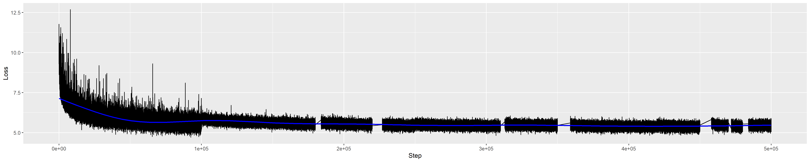

# WaveNet in TF2

This code is an implementation of WaveNet. The algorithm is based on the following papers:

```
Oord, A. V. D., Dieleman, S., Zen, H., Simonyan, K., Vinyals, O., Graves, A., ... & Kavukcuoglu, K. (2016). Wavenet: A generative model for raw audio. arXiv preprint arXiv:1609.03499.
Paine, T. L., Khorrami, P., Chang, S., Zhang, Y., Ramachandran, P., Hasegawa-Johnson, M. A., & Huang, T. S. (2016). Fast wavenet generation algorithm. arXiv preprint arXiv:1611.09482.
Oord, A. V. D., Li, Y., Babuschkin, I., Simonyan, K., Vinyals, O., Kavukcuoglu, K., ... & Casagrande, N. (2017). Parallel wavenet: Fast high-fidelity speech synthesis. arXiv preprint arXiv:1711.10433.
Salimans, T., Karpathy, A., Chen, X., & Kingma, D. P. (2017). Pixelcnn++: Improving the pixelcnn with discretized logistic mixture likelihood and other modifications. arXiv preprint arXiv:1701.05517.
```

* This code is applied the Fast WaveNet and Discrete Mixture of Logistic.

I referred a lot of parts of modules from [r9y9's WaveNet github](https://github.com/r9y9/wavenet_vocoder). And I referred some parts of UpsampleNet and MoL modules from [fatchord's WaveRNN github](https://github.com/fatchord/WaveRNN).

# Requirements
Please see the 'requirements.txt'.

# Structrue


# Used dataset
Currently uploaded code is compatible with the following datasets. The O mark to the left of the dataset name is the dataset actually used in the uploaded result. Wavenet requires speaker id for multi-speaker processing, so if you want to add another dataset, you must consider the id labelling method.

```
[O] LJSpeech: https://keithito.com/LJ-Speech-Dataset/
[X] Blizzard Challenge 2013: http://www.cstr.ed.ac.uk/projects/blizzard/
[O] FastVox: http://www.festvox.org/cmu_arctic/index.html
```

# Hyper parameters
Before proceeding, please set the pattern, inference, and checkpoint paths in 'Hyper_Parameter.json' according to your environment.

* Sound
    * Setting basic sound parameters.

* WaveNet
    * Setting the parameters of WaveNet.
    * In upsample, the product of all of upsample scales must be same to frame shift size of sound.
    * MoL size must be a multiple of 3.

* Train
    * Setting the parameters of training.
    * Wav length must be a multiple of frame shift size of sound.
    
* Use_Mixed_Precision
    * __Currently, when this option is true, Nan loss occurs. I don't recommend use this option.__ 
    * Setting the usage of mixed precision.
    * If using, the tensors are stored by 16bit, not 32bit.
    * The weights are stored by 32bit, so the model is compatible with checkpoints learned with different mixed precisions if the rest of the parameters are the same.
    * Usually, this parameter makes be possible to use larger batch size.
    * In the unsupported machine, the speed is extreamly slower.
    * When using, I recommend to increase the epsilon of ADAM to 1e-4 to prevent the underflow problem.
    * See the following reference for details.
        * https://www.tensorflow.org/api_docs/python/tf/keras/mixed_precision/experimental/Policy
    
* Inference_Path
    * Setting the inference path

* Checkpoint_Path
    * Setting the checkpoint path

* Device
    * Setting which GPU device is used in multi-GPU enviornment.
    * Or, if using only CPU, please set '-1'.

# Generate pattern

## Command
```
python Pattern_Generate.py [parameters]
```

## Parameters

At least, one or more of datasets must be used.

* -lj <path>
    * Set the path of LJSpeech. LJSpeech's patterns are generated.
* -bc2013 <path>
    * Set the path of Blizzard Challenge 2013. Blizzard Challenge 2013's patterns are generated.
* -fv <path>
    * Set the path of FastVox. FastVox's patterns are generated.
* -mc
    * Ignore patterns that exceed the set number of each dataset.
* -mw
    * The number of threads used to create the pattern
    
# Inference file path while training for verification.

* Inference_Wav_for_Training.txt
    * Wav path and speaker id which are used for inference while training.

# Run

## Command
```
python Model.py
```
    
# Inference

1. Run 'ipython' in the model's directory.
2. Run following command:
```
from Model import WaveNet
new_Model = WaveNet(is_Training= False)
new_Model.Restore()
```
3. There are two ways to insert mels.
    1. Make two lists of Mel patterns and speaker ids. Each mel's type and shape must be numpy array and '[Time, Mel_dim]'. And each speaker id is a scalar.
    ```
    mel_List = [mel1, mel2, mel3, ...]
    mel_Speaker_List = [speaker_id1, speaker_id2, speaker_id3, ...]
    ```
    2. Insert a path of wav files.
    ```
    path_List = [
        './Wav_for_Inference/FV.AWB.arctic_a0001.wav'
        './Wav_for_Inference/FV.JMK.arctic_a0004.wav'
        './Wav_for_Inference/FV.SLT.arctic_a0007.wav'
        './Wav_for_Inference/LJ.LJ050-0278.wav'
        ]
    path_Speaker_List = [speaker_id1, speaker_id2, speaker_id3, ...]
    ```
4. Run following command:
```
new_WaveNet.Inference(
    mel_List= mel_List,
    mel_Speaker_List= mel_Speaker_List,
    wav_List= path_List,
    wav_Speaker_List= path_Speaker_List,
    label= None,
    split_Mel_Window= 7,
    overlap_Window= 1,
    batch_Size= 16
    )
```
* Parameters
    * `mel_List and wav_List`
        * The list you set at section 3.
    * `mel_Speaker_List and wav_Speaker_List`
        * The speaker id list you set at section 3.
    * `label`
        * A label of inferenced file.
        * If None, the datetime is assigned.
    * `split_Mel_Window`
        * Mel length calculated as a single sequence.
        * The higher the value, the higher the quality but slower the inference.
    * `overlap_Window`
        * The length of the part to be calculated by overlapping the previous sequence in the divided mel.
        * The larger this value, the less the quality degradation during deployment.
    * `batch_Size`
        * Decide how many split mel sequences to calculate at one time.
        * Larger is faster, but it can cause out of memory problems.

# Result

* The following results are based on the checkpoint of 100000 steps of 16 batchs (76.15 epochs).
* 8 Talkers (1 LJSpeech + 7 FastVox) are trained.
* The result is based on the original wav file. The joint with the voice synthesizer has not been progressed yet.
* Voice quality is not perfect, but I think that the reason is because the insufficient learning steps.
* I will train more.



[Wav_IDX_0](./Example_Results/Wav/20200330.224818.IDX_0.WAV)


[Wav_IDX_1](./Example_Results/Wav/20200330.224818.IDX_1.WAV)


# Trained checkpoint

[Checkpoint here](./Example_Results/Checkpoint/Checkpoint.zip)

* This is the checkpoint of 100000 steps of 16 batchs (76.15 epochs).
* 8 Talkers (1 LJSpeech + 7 FastVox) are trained.

# Future works
0. More training

1. Integrating GST Tacotron
    * https://github.com/CODEJIN/GST_Tacotron    
    * I need retrain because of the sound parameter differences.